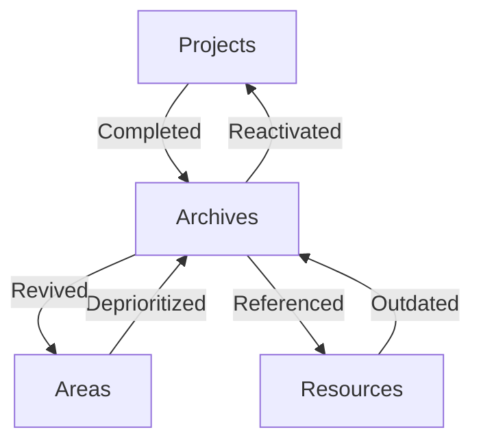

# PARA Method

> [!SOURCE] Sources:
> - *[Building a Second Brain](https://www.buildingasecondbrain.com/)*
> - *Tiago Forte*

```table-of-contents
title: Contents
style: nestedList
minLevel: 2
maxLevel: 4
includeLinks: true
```

## Overview

The PARA Method is an organizational system developed by **Tiago Forte** as part of his "Building a Second Brain" methodology. PARA stands for **Projects, Areas, Resources, and Archives** - the four main categories used to organize all digital information.

## The Four Categories

### 1. Projects

**Definition**: A series of tasks linked to a goal, with a deadline.

| Characteristic | Description |
|---------------|-------------|
| Outcome | Has a defined deliverable |
| Deadline | Has a timeline (even if self-imposed) |
| Tasks | Involves multiple action items |
| Completion | Has a clear "done" state |

**Examples:**
- Launch a new website
- Write a business proposal
- Develop a new feature
- Plan an event

### 2. Areas

**Definition**: Spheres of activity with standards to maintain over time.

| Characteristic | Description |
|---------------|-------------|
| Ongoing | No completion date |
| Responsibility | Contains roles, not goals |
| Standards | Has quality benchmarks |
| Attention | Requires continuous focus |

**Examples:**
- Health
- Finances
- Professional Development
- Relationships
- Business Operations

### 3. Resources

**Definition**: Topics or themes of ongoing interest.

| Characteristic | Description |
|---------------|-------------|
| Topic-based | Organized by subject |
| Reference | Valuable for future lookup |
| Not actionable | No immediate tasks |
| Knowledge | Information worth preserving |

**Examples:**
- Programming languages
- Industry research
- Book notes
- Tool documentation

### 4. Archives

**Definition**: Inactive items from the other three categories.

| Characteristic | Description |
|---------------|-------------|
| Completed | Projects that are done |
| Paused | Areas no longer active |
| Outdated | Resources no longer relevant |
| Preserved | Kept for historical reference |

## Flow Between Categories



## Key Distinction: Project vs Area

The most important distinction in PARA:

| Project | Area |
|---------|------|
| "Finish writing book" | "Writing" |
| "Lose 10 pounds" | "Health" |
| "Launch product X" | "Product Development" |
| "Hire new developer" | "Team Management" |

> [!TIP] The Test
> Ask yourself: "Can I mark this complete?"
> - **Yes** → It's a Project
> - **No** → It's an Area

## Adaptation for This Vault

This vault adapts PARA for a **knowledge base** rather than task management:

| Standard PARA | This Vault |
|---------------|------------|
| Projects | Kept with project repos, not in vault |
| Areas | MOCs in `03-AREAS/` |
| Resources | `04-RESOURCES/` (Code, Definitions, Lists, Guides) |
| Archives | `99-ARCHIVES/` |

See [[05-SYSTEM/Meta/PHILOSOPHY]] for the rationale behind this adaptation.

---

## See Also

- [[05-SYSTEM/Meta/PHILOSOPHY]]
- [[Zettelkasten Method]]
- [[MOC - PKM]]

---

(c) [No Clocks, LLC](https://github.com/noclocks) | 2024

