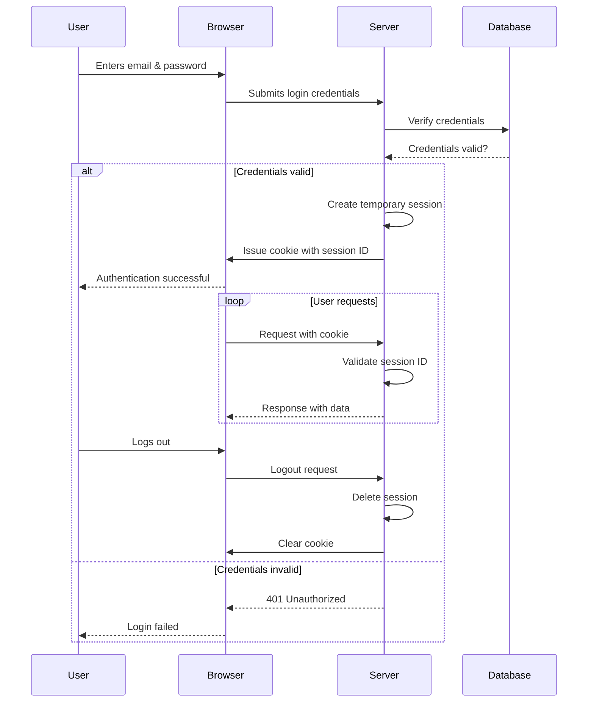
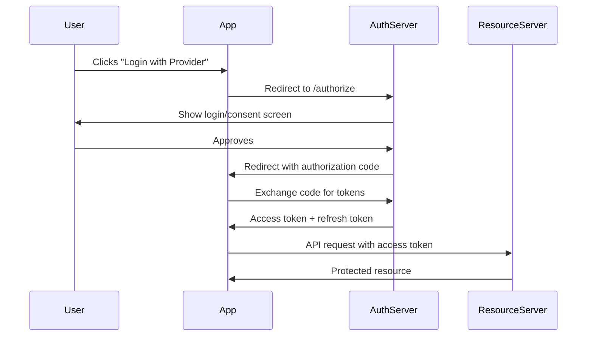

# Guide - Web Authentication

> [!SOURCE] Sources:
> - *[alex996/presentations/auth.md](https://github.com/alex996/presentations/blob/master/auth.md)*

```table-of-contents
title: Contents
style: nestedList
minLevel: 2
maxLevel: 4
includeLinks: true
```

## Overview

Understanding the difference between authentication and authorization:

- **Authentication**: Verifying Identity (`401 Unauthorized`)
- **Authorization**: Verifying Permissions (`403 Forbidden`)

Two main approaches to username/password authentication:

- **Stateful** (Session-based using Cookies)
- **Stateless** (Token-based using JWT/OAuth)

## Session-Based Authentication

### Flow

1. User submits login credentials (email & password)
2. Server verifies credentials against database
3. Server creates temporary user **session**
4. Server issues a **cookie** with a **session ID**
5. User sends cookie with every request
6. Server validates cookie using session store & grants access
7. When user logs out, server deletes session and clears cookie

### Sequence Diagram



### Session Features

| Feature | Description |
|---------|-------------|
| **Session Store** | Redis, Memcached, or database for session data |
| **Session ID** | Cryptographically random, stored in cookie |
| **Cookie Flags** | `HttpOnly`, `Secure`, `SameSite` for security |
| **Expiration** | Server-controlled session lifetime |

### Pros & Cons

| Pros | Cons |
|------|------|
| Server can revoke sessions instantly | Requires session storage (memory/database) |
| Session data stays on server (secure) | Horizontal scaling requires shared session store |
| Simple to implement | CSRF protection required |
| Works with all clients | Cookies don't work well for mobile/APIs |

## Token-Based Authentication (JWT)

### Flow

1. User submits login credentials
2. Server verifies credentials
3. Server generates and signs a **JWT**
4. Server sends JWT to client
5. Client stores JWT (localStorage, sessionStorage, or cookie)
6. Client sends JWT with every request (Authorization header)
7. Server validates JWT signature & grants access
8. No server-side session storage needed

### JWT Structure

```
header.payload.signature
```

**Header:**
```json
{
  "alg": "HS256",
  "typ": "JWT"
}
```

**Payload:**
```json
{
  "sub": "user_id",
  "name": "John Doe",
  "iat": 1516239022,
  "exp": 1516242622
}
```

**Signature:**
```
HMACSHA256(
  base64UrlEncode(header) + "." + base64UrlEncode(payload),
  secret
)
```

### Pros & Cons

| Pros | Cons |
|------|------|
| Stateless - no server storage | Cannot revoke tokens before expiration |
| Scales horizontally easily | Payload visible (base64 encoded, not encrypted) |
| Works well for APIs and mobile | Token size larger than session ID |
| Cross-domain friendly | Refresh token strategy required for long sessions |

## OAuth 2.0

### Grant Types

| Grant Type | Use Case |
|------------|----------|
| **Authorization Code** | Web apps with backend (most secure) |
| **Authorization Code + PKCE** | SPAs and mobile apps |
| **Client Credentials** | Machine-to-machine |
| **Implicit** | Legacy, not recommended |
| **Resource Owner Password** | Legacy, not recommended |

### Authorization Code Flow



## Security Best Practices

### Cookie Security

```http
Set-Cookie: session_id=abc123; 
  HttpOnly; 
  Secure; 
  SameSite=Strict; 
  Path=/; 
  Max-Age=3600
```

| Flag | Purpose |
|------|---------|
| `HttpOnly` | Prevents JavaScript access (XSS protection) |
| `Secure` | Only sent over HTTPS |
| `SameSite=Strict` | CSRF protection |
| `Path=/` | Cookie scope |

### Token Security

- Store in `httpOnly` cookie (not localStorage) when possible
- Use short expiration times (15 min for access tokens)
- Implement refresh token rotation
- Validate all claims (`iss`, `aud`, `exp`)

### Password Hashing

```python
# Use bcrypt, Argon2, or scrypt - NEVER MD5 or SHA1
import bcrypt
hashed = bcrypt.hashpw(password.encode(), bcrypt.gensalt(12))
```

## When to Use What

| Scenario | Recommendation |
|----------|----------------|
| Traditional web app | Session + Cookie |
| SPA with same-origin API | Session + Cookie (via proxy) |
| SPA with cross-origin API | JWT in httpOnly cookie |
| Mobile app | JWT with secure storage |
| Public API | OAuth 2.0 / API Keys |
| Microservices | JWT for service-to-service |

---

## See Also

- [[Glossary - Identity and Access Management]]
- [[Definition - JSON Web Token (JWT)]]
- [[Definition - OAuth]]
- [[MOC - Security]]

---

(c) [No Clocks, LLC](https://github.com/noclocks) | 2024


