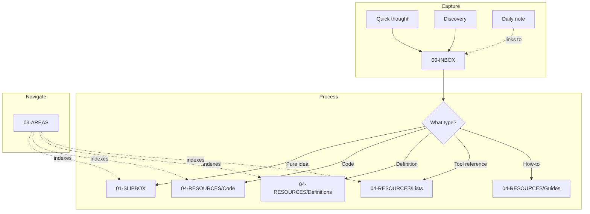

# Vault Philosophy

```table-of-contents
title: Contents
style: nestedList
minLevel: 1
maxLevel: 4
includeLinks: true
```

## Overview

This document captures the core philosophy, structure decisions, and conventions that govern the No Clocks Knowledge Vault. It represents the culmination of deliberate thinking about how a knowledge base should be organized for maximum utility and minimal friction.

## Core Philosophy

### What This Vault Is

This vault is a **knowledge base**, not a task manager. It stores:

- **Your knowledge** - insights, discoveries, learned wisdom
- **Reference material** - curated lists, code snippets, definitions
- **Temporal records** - daily logs, weekly reviews
- **Navigation structures** - MOCs that tie everything together

### What This Vault Is Not

- **Not a project management system** - project docs stay with projects (in repos, etc.)
- **Not a documentation mirror** - link to official docs, don't duplicate them
- **Not a file dump** - every note should have purpose and place

### The Guiding Principle

> **Your vault stores YOUR knowledge, not duplicated documentation.**

If information exists and is maintained elsewhere (official docs, websites, APIs), link to it. Your vault captures:

- What YOU learned
- YOUR customizations and configurations
- YOUR curated selections and opinions
- YOUR connections between ideas

---

## Vault Structure

### The Knowledge Flow

```
CAPTURE → PROCESS → NAVIGATE → REFERENCE
```

1. **Capture**: Quick thoughts go to Inbox
2. **Process**: Route to appropriate location based on type
3. **Navigate**: MOCs provide global indices
4. **Reference**: Find what you need when you need it

### Folder Hierarchy

```
NoClocksVaultNew/
  00-INBOX/         # Quick capture entry point
  01-SLIPBOX/       # Atomic, polished permanent notes (non-typed)
  02-JOURNAL/       # Temporal notes (Daily, Weekly, Monthly)
  03-AREAS/         # MOCs - global knowledge indices
  04-RESOURCES/     # Typed reference knowledge
  05-SYSTEM/        # Vault configuration and meta
  99-ARCHIVES/      # Inactive content
  quartz/           # Quartz publishing configuration
```

### Folder Purposes

| Folder | Purpose | Content |
|--------|---------|---------|
| **00-INBOX** | Quick capture, unsorted | Temporary home for new notes |
| **01-SLIPBOX** | Atomic permanent notes | Pure ideas/insights, not typed |
| **02-JOURNAL** | Temporal notes | Daily, Weekly, Monthly, Quarterly, Annual |
| **03-AREAS** | Global knowledge indices | MOCs that span all topics |
| **04-RESOURCES** | Typed reference knowledge | Code, Definitions, Lists, Guides, Checklists |
| **05-SYSTEM** | Vault configuration | Templates, Assets, Meta documentation |
| **99-ARCHIVES** | Inactive content | Deprecated or completed items |

---

## Key Decisions

### Why Not Classic PARA?

The original PARA method (Projects, Areas, Resources, Archives) was designed for task management. For a knowledge base, the distinctions are different:

- **Projects** folder eliminated - project docs stay with projects (repos, project folders)
- **Areas vs. Resources** friction resolved - Areas contains MOCs, Resources contains typed content
- **Journal** gets its own space - temporal notes deserve dedicated home

### The Tools Decision

#### Problem

"Tool" is too broad a category. Languages, frameworks, services, CLI utilities - everything could be a "tool." The old vault had 601 mostly-stub Tool notes.

#### Solution: Link-First Approach

| Instead of... | Use... |
|--------------|--------|
| `Tool - Docker.md` with copied docs | `List - DevOps Tools.md` with Docker row + URLs |
| Individual notes duplicating online content | Curated lists linking to authoritative sources |
| 601 mostly-stub tool notes | ~15-20 curated List notes |
| Tool-specific customizations in tool notes | Customizations live in Code/Guide notes |

#### Where Tool Knowledge Lives

| Type of Knowledge | Location |
|-------------------|----------|
| "I discovered this tool" | Add row to relevant List note |
| "Here's my Docker config" | `Code - Docker - Compose Templates.md` |
| "How I set up my dev environment" | `Guide - Local Development Environment.md` |
| "Steps to deploy to Vercel" | `Guide - Vercel Deployment.md` |

### Unified Definitions

All term definitions use the same prefix regardless of whether they're acronyms or dictionary terms:

- `Definition - Application Programming Interface (API).md`
- `Definition - Normalization.md`

Differentiate with tags: `Type/Definition` + `Type/Acronym` for acronyms.

### Flat Topic Tags

Topic tags are flat, not nested. Let MOCs provide the hierarchy.

```yaml
# Good - flat, combinable
Topic/R
Topic/Shiny
Topic/GIS

# Avoid - over-nested
Topic/Development/Languages/R/Frameworks/Shiny
```

Combine flat tags for specificity: `#Topic/R` + `#Topic/Shiny` = R Shiny content.

---

## Naming Conventions

### File Prefixes by Type

Every note uses a type prefix. Aliases in frontmatter provide clean wikilink resolution.

| Type | Pattern | Example | Aliases |
|------|---------|---------|---------|
| MOC | `MOC - {Topic}.md` | `MOC - R.md` | `R Map of Content` |
| Code | `Code - {Lang} - {Desc}.md` | `Code - R - Shiny Helpers.md` | `R Shiny Helpers` |
| Definition | `Definition - {Term}.md` | `Definition - API.md` | `API` |
| List | `List - {Category}.md` | `List - DevOps Tools.md` | `DevOps Tools` |
| Guide | `Guide - {Topic}.md` | `Guide - Local Dev Setup.md` | `Local Dev Setup` |
| Checklist | `Checklist - {Topic}.md` | `Checklist - Deployment.md` | `Deployment Checklist` |
| Readme | `_README.md` | `_README.md` | `{Folder} Index` |

### Benefits of Prefixing

- Files sort by type in file explorer
- Wikilinks can use clean aliases: `[[Docker]]` resolves to the right note
- Consistent pattern across vault
- Easy to search/filter by prefix

---

## Tag Taxonomy

### Structure

```yaml
Status/          # Lifecycle state
  Complete       # Finished, polished
  WIP            # Work in progress
  Draft          # Initial state
  Ongoing        # Continuously updated

Type/            # Note classification (matches file prefix)
  MOC            # Map of Content
  Code           # Code snippet
  Definition     # Term definition
  Acronym        # (used with Definition)
  List           # Curated list
  Guide          # How-to
  Checklist      # Actionable list
  Readme         # Folder index
  Daily, Weekly, Monthly  # Temporal

Topic/           # Subject domain (flat, combinable)
  R, Python, PowerShell, SQL, JavaScript
  Shiny, React, Docker, Git
  GIS, Database, Cloud, DevOps, AI, Web, API
  Business, Finance, Legal
  PKM, Obsidian
```

### Tagging Rules

1. Every note gets exactly one `Status/` tag
2. Every note gets at least one `Type/` tag (matches file prefix)
3. Every note gets 1-3 `Topic/` tags (don't over-tag)
4. Combine Topic tags for specificity

---

## The Daily Note System

Daily notes serve dual purposes:

### 1. Entry Point for Capture

```markdown
## Quick Captures
- Discovered [[New Tool]] - need to add to Lists
- Idea about [[Concept]] -> creates inbox note for processing
```

### 2. Activity Log

Even if not used as the entry point, daily notes log what happened:

```markdown
## Changes Made Today
- Created [[Code - R - New Function]]
- Updated [[MOC - R]] with new links

## Discoveries
- Found useful article about X (link)
```

---

## Note Processing Flow



---

## What Belongs Where

| Content | Destination | Notes |
|---------|-------------|-------|
| Quick thought/link | 00-INBOX | Process later |
| Atomic insight | 01-SLIPBOX | Not typed, just pure ideas |
| Today's log | 02-JOURNAL/Daily | `YYYY-MM-DD.md` |
| Topic navigation | 03-AREAS | MOC notes |
| Code snippet | 04-RESOURCES/Code | Organized by language/tool |
| Term definition | 04-RESOURCES/Definitions | Acronyms, Dictionary, Glossary |
| Curated tool list | 04-RESOURCES/Lists | Link-first approach |
| How-to steps | 04-RESOURCES/Guides | Your processes |
| Actionable checklist | 04-RESOURCES/Checklists | Reusable checklists |

---

## Anti-Patterns to Avoid

### Don't Duplicate Documentation

If Docker has docs at docker.com, don't copy them. Link to them.

### Don't Over-Nest Tags

`Topic/Development/Languages/R/Packages/Shiny` is unwieldy. Use `Topic/R` + `Topic/Shiny`.

### Don't Create Stub Notes

If you only have "Docker is a containerization tool" - that's not worth a note. Add it to a List instead.

### Don't Keep Project Docs Here

Project documentation belongs with the project. This vault is for cross-project knowledge.

---

## Related Notes

- [[AI Setup]]
- [[PLUGINS]]
- [[Tag Taxonomy]]
- [[AGENTS]]

## Appendix

*Created: 2024-12-20 | Modified: 2024-12-20*

### Backlinks

```dataview
LIST FROM [[Vault Philosophy]] AND -"CHANGELOG" AND -"05-SYSTEM/Meta/Vault Philosophy"
```
